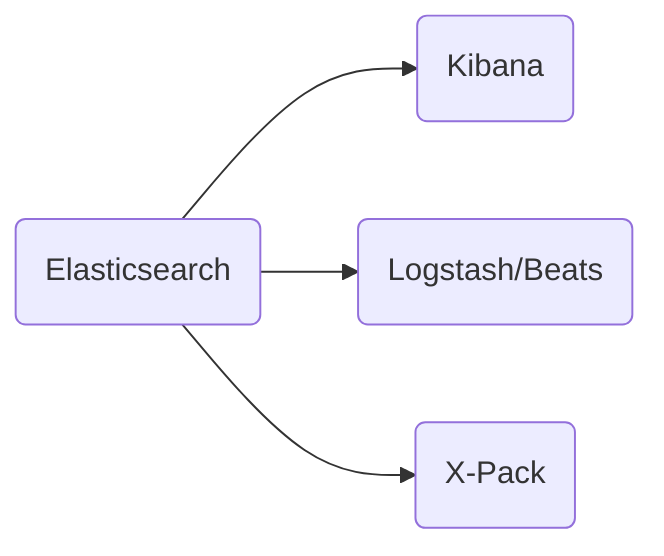
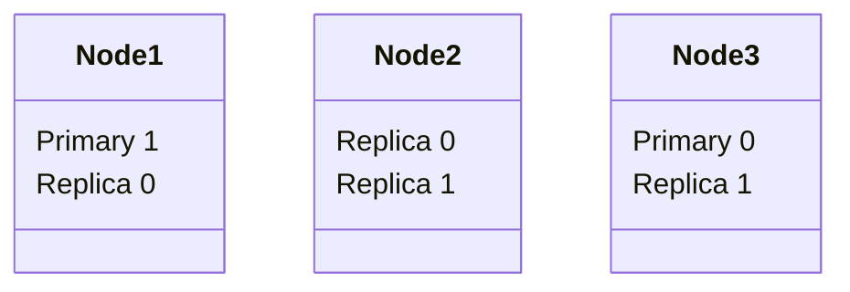

# Elasticsearch 8 and the Elastic Stack: In Depth and Hands On

### A Udemy Course

[Course](https://www.udemy.com/course/elasticsearch-7-and-elastic-stack/) |
[ElasticSearch Docs](https://www.elastic.co/webinars/getting-started-elasticsearch?rogue=webinar&baymax=&storm=hero&elektra=home)

## TOC

- [Elasticsearch 8 and the Elastic Stack: In Depth and Hands On](#elasticsearch-8-and-the-elastic-stack-in-depth-and-hands-on)
    - [A Udemy Course](#a-udemy-course)
  - [TOC](#toc)
  - [Section 1: Installing and Understanding Elasticsearch](#section-1-installing-and-understanding-elasticsearch)
    - [Introduction](#introduction)
      - [Basic Commands](#basic-commands)
    - [Elasticsearch Overview](#elasticsearch-overview)
      - [The Elastic Stack](#the-elastic-stack)
    - [Intro to HTTP and RESTful APIs](#intro-to-http-and-restful-apis)
      - [Rest: A Quick Intro](#rest-a-quick-intro)
        - [Anatomy of a Http Request](#anatomy-of-a-http-request)
        - [Example: Your browser wants to display our website](#example-your-browser-wants-to-display-our-website)
      - [Restful APIs](#restful-apis)
      - [Rest Fancy-speak](#rest-fancy-speak)
      - [Why Rest?](#why-rest)
      - [The curl command](#the-curl-command)
    - [Elasticsearch Basics: Logical Concepts](#elasticsearch-basics-logical-concepts)
      - [Logical Concepts of Elasticsearch](#logical-concepts-of-elasticsearch)
    - [Term Frequency/Inverse Document Frequency (TF/IDF)](#term-frequencyinverse-document-frequency-tfidf)
      - [What Is An Inverted Index](#what-is-an-inverted-index)
      - [Of Course It's Not That Simple](#of-course-its-not-that-simple)
    - [Using Elasticsearch](#using-elasticsearch)
      - [Using Indices](#using-indices)
    - [What's New In Elasticsearch 8](#whats-new-in-elasticsearch-8)
    - [How Elasticsearch Scales](#how-elasticsearch-scales)
      - [An Index is Split into Shards](#an-index-is-split-into-shards)
      - [Primary and Replica Shards](#primary-and-replica-shards)
      - [The Number of Primary Shards Cannot Be Changed Later](#the-number-of-primary-shards-cannot-be-changed-later)

## Section 1: Installing and Understanding Elasticsearch

### Introduction

#### Basic Commands

- start elasticsearch on mac (installed with homebrew): `elasticsearch`
- poll server: `curl -XGET 127.0.0.1:9200`

```json
{
  "name": "node-1",
  "cluster_name": "elasticsearch",
  "cluster_uuid": "7zDbLjTATs-KncZp6JLORg",
  "version": {
    "number": "7.17.4",
    "build_flavor": "default",
    "build_type": "tar",
    "build_hash": "79878662c54c886ae89206c685d9f1051a9d6411",
    "build_date": "2022-05-18T18:04:20.964345128Z",
    "build_snapshot": false,
    "lucene_version": "8.11.1",
    "minimum_wire_compatibility_version": "6.8.0",
    "minimum_index_compatibility_version": "6.0.0-beta1"
  },
  "tagline": "You Know, for Search"
}
```

- submit to elasticsearch (single document) to index: `curl -H "Content-Type: application/json" -XPUT 127.0.0.1:9200/shakespeare --data-binary @shakes-mapping.json`

or

- submit to elasticsearch (lots of documents) to index: `curl -H "Content-Type: application/json" -XPUT '127.0.0.1:9200/shakespeare/_bulk' --data-binary @shakespeare_8.0.json`
- simple search for a phrase: `curl -H "Content-Type:application/json -XGET '127.0.0.1:9200/shakespeare/_search?pretty' -d`

```bash
dquote> {
dquote> "query" : {
dquote> "match_phrase" : {
dquote> "text-entry" : "to be or not to be"
dquote> }
dquote> }
dquote> }'
```

[back](#toc)

### Elasticsearch Overview

#### The Elastic Stack



1. Elasticsearch
   1. Started off as scalable Lucene
   2. Horizontally scalable search engine
   3. Each "shard" is an inverted index of documents
   4. But not just for full text search!
   5. Can handle structured data, and can aggregate data quickly
   6. Ofter a faster solution than Hadoop/Spark/Flink/etc.
   - basically a server than can handle JSON requests and send back information in JSON
2. Kibana
   1. Web UI for searching and visualization
   2. Complex aggregations, graphs and charts
   3. Often used for log analysis
   - sits on top of Elasticsearch
3. Logstash/Beats
   1. Ways to feed data into Elasticsearch
   2. FileBeat can monitor log files, parse them, and import into Elasticsearch in near-real-time
   3. Logstash also pushes data into Elasticsearch from many machines
   4. Not just log files
   - can collect data from numerous sources like S3, Kafka, etc.
4. X-Pack
   1. Security
   2. Alerting
   3. Monitoring
   4. Reporting
   5. Machine Learning
   6. Graph Exploration

[back](#toc)

### Intro to HTTP and RESTful APIs

#### Rest: A Quick Intro

Elasticsearch is built on a RESTful api - must communicate with it through http requests

##### Anatomy of a Http Request

- **METHOD**: The "verb" of the request. GET, POST, PUT or DELETE
- **PROTOCOL**: What flavor of HTTP (HTTP/1.1)
- **HOST**: What web server you want to talk to
- **URL**: What resource is being requested
- **BODY**: Extra data needed by the server
- **HEADERS**: User-agent, content-type, etc.

##### Example: Your browser wants to display our website

- GET /index.html
- Protocol: HTTP/1.1
- Host: www.sundog-education.com
- No body
- Headers:

```bash
User-Agent: Mozilla/5.0 (Windows; U; Windows NT 6.1; en-US; rv:1.9.1.5) Gecko/20091102 Firefox/3.5.5 (.NET CLR 3.5.30729)
Accept: text/html,application/xhtml+xml,application/xml;q=0.9,*/*;q=0.8
Accept-Language: en-us,en;q=0.5
Accept-Encoding: gzip,deflate
Accept-Charset: ISO-8859-1,utf-8;q=0.7,*;q-0.7
Keep-Alive: 300
Connection: keep-Alive
Cookie: PHPSESSID=r2tuvjq435r4q7ib3vtdjq120
Pragma: no-cache
Cache-Control: no-cache
```

#### Restful APIs

**Pragmatic Definition:** Using Http requests to communicate with web services

Examples:

**GET** requests retrieve information (like serach results)
**PUT** requests insert or replace new information
**DELETE** requests delete information

#### Rest Fancy-speak

Representational State Transfer

Six Guiding Constraints

1. Client-server architecture
2. Statelessness
   - every request and response must be self contained
   - cannot assume there is any memory on the client or server
3. Cacheability
   - just means the system allows for cacheing
4. Layered system
5. Code on demand (ie, sending Javascript)
6. Uniform interface
   - high-level: data has some structure and predictable

#### Why Rest?

Language and system independent

- no matter the language you use (ie. Python, Java, JavaScript), they all have a way of sending HTTP requests

#### The curl command

A way to use HTTP requests from the command line

From code, you'll use whatever library you use for HTTP/REST in the same way.

`curl -H "Content-Type: application/json" <URL> -d '<BODY>'`

[back](#toc)

### Elasticsearch Basics: Logical Concepts

#### Logical Concepts of Elasticsearch

- Documents
  - documents are things you are searching for
  - they can be more than text - any structured JSON data works
  - every document has a unique id and a type
- Indices
  - an index powers search into all documents within a collection of types
  - they contain **inverted indices** that let you search across everything in them at once
  - **mappings** that define schemas for the data within

[back](#toc)

### Term Frequency/Inverse Document Frequency (TF/IDF)

#### What Is An Inverted Index

**Document 1**:

Space the final frontier. These are the voyages...

**Document 2**:

He's bad, he's number one. He's the space cowboy with the laser gun!

**Inverted Index**

space: 1, 2
the: 1, 2
final: 1
frontier: 1
he: 2
bad: 2

#### Of Course It's Not That Simple

**TF_IDF** means Term Frequency \* Inverse Document Frequency

**Term Frequency** is how often a term appears in a <span style="color: green;">given document</span>

**Document Frequency** is how often a term appears in <span style="color: green;">all documents</span>

**Term Frequency/Document Frequency** measures the <span style="color: green;">relavence</span> of a term in a document

[back](#toc)

### Using Elasticsearch

#### Using Indices

- RESTful API
  - Elasticsearch fundamentally works via HTTP requests and JSON data
  - Any language or tool that can handle HTTP can handle Elasticsearch
- Client API
  - Most languages have specialized Elasticsearch librariesto make it even easier
- Analytic Tools
  - Web-based graphical UI'ssuch as Kibana let you ineteract with your indices and explore them without writing code

[back](#toc)

### What's New In Elasticsearch 8

- The concept of document types are gone for good
- Data streams are mature
- Security enabled by default and is tighter
- Natural Language Processing (NLP) via imported PyTroch Models
- "Serverless log ingestion" from AWS Elastic Cloud
- Elastic Agents for Azure and Cassandra
- Vector similarity/kNN search (experimental)
- Machine learning (experimental)
- New canvas editor
- Maps/vector tile support
- New Kibana UI
- Enterprise search

[back](#toc)

### How Elasticsearch Scales

#### An Index is Split into Shards

- Documents are <span style="color: blue;">hashed</span> to a particular <span style="color: blue;">shard</span>
- Each shard may be on a different <span style="color: blue;">node</span> in a <span style="color: blue;">cluster</span>
- Every shard is a self-contained Lucene index of its own
  - if you have a cluster of computers, you can spread theses shards across multiple machines
  - as you need more capacity, you can throw more machines into your cluster and add more shards into that index so it can spread that load out more efficiently

#### Primary and Replica Shards

- one way Elasticsearch maintains resilency to failure

- This <span style="color: blue;">index</span> has two <span style="color: blue;">primary shards</span> and two <span style="color: blue;">replicas</span>
- Your application should round-robin requests amongst nodes



- <span style="color: blue;">Write</span> requests are routed to the primary shard, then replicated
  - bottle-necked by the number of primary shards you have
- <span style="color: blue;">Read</span> requests are routed to the primary shardor any replica
  - this is quicker
  - spread out the reads more efficiently
  - more replicas you have, the more read capacity you have

> 📎 NOTE:
>
> It is a good idea to have an odd number of nodes for maximum resilency

#### The Number of Primary Shards Cannot Be Changed Later

- not as bad as it sounds - you can add <span style="color: blue;">more replica shards</span> for more read throughput
- worst case you can <span style="color: blue;">re-index</span> your data
- The number of shards can be set up front via a PUT commandvia <span style="color: blue;">REST</span>/HTTP

```bash
PUT /testindex
{
  "settings":{
    "number_of_shards": 3,
    "number_of_replicas": 1
  }
}
```

> 📎 NOTE:
>
> In the example above, we are setting 3 primary shards and
> one replica shard for each primary shard for a total of
> 6 shards.

[back](#toc)
