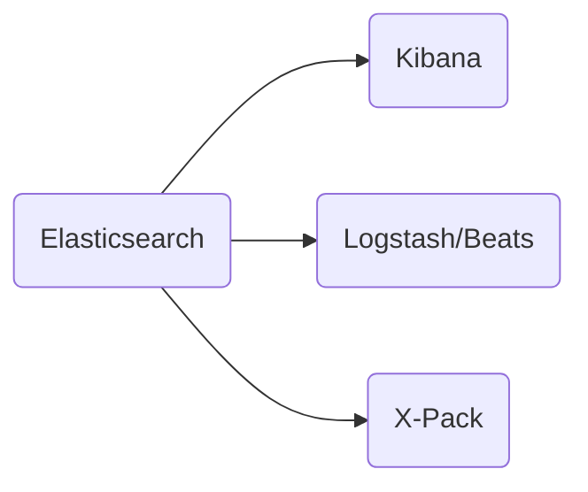
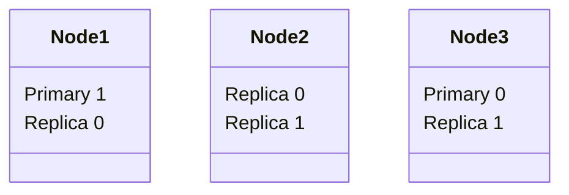
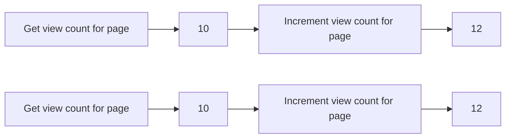
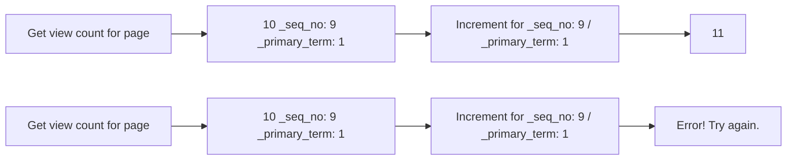
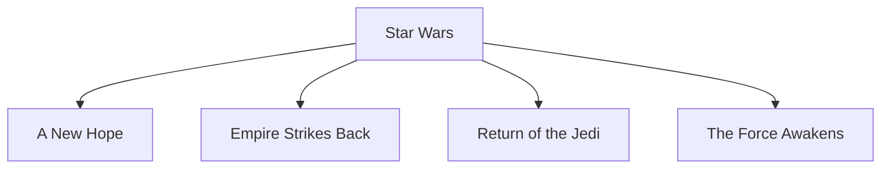
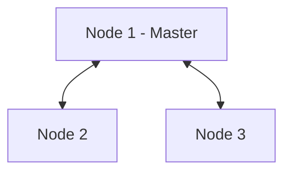
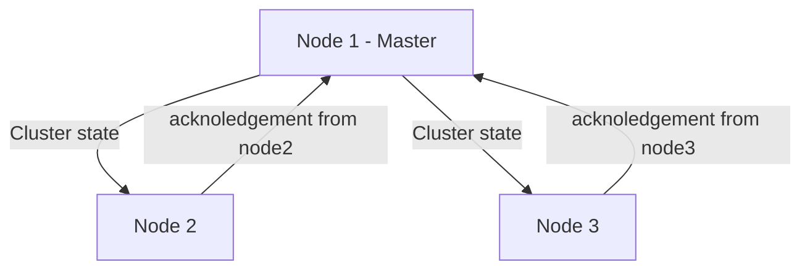

# Elasticsearch 8 and the Elastic Stack: In Depth and Hands On

### A Udemy Course

[Course](https://www.udemy.com/course/elasticsearch-7-and-elastic-stack/) |
[ElasticSearch Docs](https://www.elastic.co/webinars/getting-started-elasticsearch?rogue=webinar&baymax=&storm=hero&elektra=home)

## TOC

- [Elasticsearch 8 and the Elastic Stack: In Depth and Hands On](#elasticsearch-8-and-the-elastic-stack-in-depth-and-hands-on)
    - [A Udemy Course](#a-udemy-course)
  - [TOC](#toc)
  - [Section 1: Installing and Understanding Elasticsearch](#section-1-installing-and-understanding-elasticsearch)
    - [Introduction](#introduction)
      - [Basic Commands](#basic-commands)
    - [Elasticsearch Overview](#elasticsearch-overview)
      - [The Elastic Stack](#the-elastic-stack)
    - [Intro to HTTP and RESTful APIs](#intro-to-http-and-restful-apis)
      - [Rest: A Quick Intro](#rest-a-quick-intro)
        - [Anatomy of a Http Request](#anatomy-of-a-http-request)
        - [Example: Your browser wants to display our website](#example-your-browser-wants-to-display-our-website)
      - [Restful APIs](#restful-apis)
      - [Rest Fancy-speak](#rest-fancy-speak)
      - [Why Rest?](#why-rest)
      - [The curl command](#the-curl-command)
    - [Elasticsearch Basics: Logical Concepts](#elasticsearch-basics-logical-concepts)
      - [Logical Concepts of Elasticsearch](#logical-concepts-of-elasticsearch)
    - [Term Frequency/Inverse Document Frequency (TF/IDF)](#term-frequencyinverse-document-frequency-tfidf)
      - [What Is An Inverted Index](#what-is-an-inverted-index)
      - [Of Course It's Not That Simple](#of-course-its-not-that-simple)
    - [Using Elasticsearch](#using-elasticsearch)
      - [Using Indices](#using-indices)
    - [What's New In Elasticsearch 8](#whats-new-in-elasticsearch-8)
    - [How Elasticsearch Scales](#how-elasticsearch-scales)
      - [An Index is Split into Shards](#an-index-is-split-into-shards)
      - [Primary and Replica Shards](#primary-and-replica-shards)
      - [The Number of Primary Shards Cannot Be Changed Later](#the-number-of-primary-shards-cannot-be-changed-later)
  - [Section 2: Mapping and Indexing Data](#section-2-mapping-and-indexing-data)
    - [Connecting to Your Cluster](#connecting-to-your-cluster)
      - [Elasticsearch More Setup](#elasticsearch-more-setup)
    - [Analyzers](#analyzers)
      - [Creating Mappings](#creating-mappings)
        - [What is a Mapping?](#what-is-a-mapping)
      - [Common Mappings](#common-mappings)
      - [More About Analyzers](#more-about-analyzers)
      - [Choices for Analyzers](#choices-for-analyzers)
    - [Import a Single Move via JSON/REST](#import-a-single-move-via-jsonrest)
      - [Insert](#insert)
    - [Insert Many Movies at Once with the Bulk API](#insert-many-movies-at-once-with-the-bulk-api)
      - [Import Many Documents](#import-many-documents)
        - [JSON Bulk Import](#json-bulk-import)
    - [Updating Data in Elasticsearch](#updating-data-in-elasticsearch)
      - [Versions](#versions)
      - [Partial Update API](#partial-update-api)
      - [Full Update](#full-update)
    - [Deleting Data in Elasticsearch](#deleting-data-in-elasticsearch)
    - [Dealing with Concurrency](#dealing-with-concurrency)
      - [The Problem](#the-problem)
      - [Optimistic Concurrency Control](#optimistic-concurrency-control)
    - [Using Analyzers and Tokenizers](#using-analyzers-and-tokenizers)
      - [Using Analyzers](#using-analyzers)
    - [Data Modeling and Parent/Child Relationships, Part 1](#data-modeling-and-parentchild-relationships-part-1)
      - [Strategies For Relational Data](#strategies-for-relational-data)
    - [Data Modeling and Parent/Child Relationships, Part 2](#data-modeling-and-parentchild-relationships-part-2)
    - [Flattened DataType](#flattened-datatype)
      - [Mapping Explosions](#mapping-explosions)
      - [Elasticsearch Cluster](#elasticsearch-cluster)
      - [Updating Cluster State](#updating-cluster-state)
      - [Match Query Summary](#match-query-summary)
      - [Supported Queries for Flattened Datatype](#supported-queries-for-flattened-datatype)
    - [Dealing with Mapping Exceptions](#dealing-with-mapping-exceptions)
      - [Mappings](#mappings)
      - [The Mapping Process](#the-mapping-process)
      - [The Mapping Result](#the-mapping-result)
      - [Mapping Challeges](#mapping-challeges)
      - [Exmaples](#exmaples)
        - [Explicit Mapping Mismatches](#explicit-mapping-mismatches)

## Section 1: Installing and Understanding Elasticsearch

### Introduction

#### Basic Commands

- start elasticsearch on mac (installed with homebrew): `elasticsearch`
- poll server: `curl -XGET 127.0.0.1:9200`

```json
{
  "name": "node-1",
  "cluster_name": "elasticsearch",
  "cluster_uuid": "7zDbLjTATs-KncZp6JLORg",
  "version": {
    "number": "7.17.4",
    "build_flavor": "default",
    "build_type": "tar",
    "build_hash": "79878662c54c886ae89206c685d9f1051a9d6411",
    "build_date": "2022-05-18T18:04:20.964345128Z",
    "build_snapshot": false,
    "lucene_version": "8.11.1",
    "minimum_wire_compatibility_version": "6.8.0",
    "minimum_index_compatibility_version": "6.0.0-beta1"
  },
  "tagline": "You Know, for Search"
}
```

- submit to elasticsearch (single document) to index: `curl -H "Content-Type: application/json" -XPUT 127.0.0.1:9200/shakespeare --data-binary @shakes-mapping.json`

or

- submit to elasticsearch (lots of documents) to index: `curl -H "Content-Type: application/json" -XPUT '127.0.0.1:9200/shakespeare/_bulk' --data-binary @shakespeare_8.0.json`
- simple search for a phrase: `curl -H "Content-Type:application/json -XGET '127.0.0.1:9200/shakespeare/_search?pretty' -d`

```bash
dquote> {
dquote> "query" : {
dquote> "match_phrase" : {
dquote> "text-entry" : "to be or not to be"
dquote> }
dquote> }
dquote> }'
```

[back](#toc)

### Elasticsearch Overview

#### The Elastic Stack



1. Elasticsearch
   1. Started off as scalable Lucene
   2. Horizontally scalable search engine
   3. Each "shard" is an inverted index of documents
   4. But not just for full text search!
   5. Can handle structured data, and can aggregate data quickly
   6. Ofter a faster solution than Hadoop/Spark/Flink/etc.
   - basically a server than can handle JSON requests and send back information in JSON
2. Kibana
   1. Web UI for searching and visualization
   2. Complex aggregations, graphs and charts
   3. Often used for log analysis
   - sits on top of Elasticsearch
3. Logstash/Beats
   1. Ways to feed data into Elasticsearch
   2. FileBeat can monitor log files, parse them, and import into Elasticsearch in near-real-time
   3. Logstash also pushes data into Elasticsearch from many machines
   4. Not just log files
   - can collect data from numerous sources like S3, Kafka, etc.
4. X-Pack
   1. Security
   2. Alerting
   3. Monitoring
   4. Reporting
   5. Machine Learning
   6. Graph Exploration

[back](#toc)

### Intro to HTTP and RESTful APIs

#### Rest: A Quick Intro

Elasticsearch is built on a RESTful api - must communicate with it through http requests

##### Anatomy of a Http Request

- **METHOD**: The "verb" of the request. GET, POST, PUT or DELETE
- **PROTOCOL**: What flavor of HTTP (HTTP/1.1)
- **HOST**: What web server you want to talk to
- **URL**: What resource is being requested
- **BODY**: Extra data needed by the server
- **HEADERS**: User-agent, content-type, etc.

##### Example: Your browser wants to display our website

- GET /index.html
- Protocol: HTTP/1.1
- Host: www.sundog-education.com
- No body
- Headers:

```bash
User-Agent: Mozilla/5.0 (Windows; U; Windows NT 6.1; en-US; rv:1.9.1.5) Gecko/20091102 Firefox/3.5.5 (.NET CLR 3.5.30729)
Accept: text/html,application/xhtml+xml,application/xml;q=0.9,*/*;q=0.8
Accept-Language: en-us,en;q=0.5
Accept-Encoding: gzip,deflate
Accept-Charset: ISO-8859-1,utf-8;q=0.7,*;q-0.7
Keep-Alive: 300
Connection: keep-Alive
Cookie: PHPSESSID=r2tuvjq435r4q7ib3vtdjq120
Pragma: no-cache
Cache-Control: no-cache
```

#### Restful APIs

**Pragmatic Definition:** Using Http requests to communicate with web services

Examples:

**GET** requests retrieve information (like serach results)
**PUT** requests insert or replace new information
**DELETE** requests delete information

#### Rest Fancy-speak

Representational State Transfer

Six Guiding Constraints

1. Client-server architecture
2. Statelessness
   - every request and response must be self contained
   - cannot assume there is any memory on the client or server
3. Cacheability
   - just means the system allows for cacheing
4. Layered system
5. Code on demand (ie, sending Javascript)
6. Uniform interface
   - high-level: data has some structure and predictable

#### Why Rest?

Language and system independent

- no matter the language you use (ie. Python, Java, JavaScript), they all have a way of sending HTTP requests

#### The curl command

A way to use HTTP requests from the command line

From code, you'll use whatever library you use for HTTP/REST in the same way.

`curl -H "Content-Type: application/json" <URL> -d '<BODY>'`

[back](#toc)

### Elasticsearch Basics: Logical Concepts

#### Logical Concepts of Elasticsearch

- Documents
  - documents are things you are searching for
  - they can be more than text - any structured JSON data works
  - every document has a unique id and a type
- Indices
  - an index powers search into all documents within a collection of types
  - they contain **inverted indices** that let you search across everything in them at once
  - **mappings** that define schemas for the data within

[back](#toc)

### Term Frequency/Inverse Document Frequency (TF/IDF)

#### What Is An Inverted Index

**Document 1**:

Space the final frontier. These are the voyages...

**Document 2**:

He's bad, he's number one. He's the space cowboy with the laser gun!

**Inverted Index**

space: 1, 2
the: 1, 2
final: 1
frontier: 1
he: 2
bad: 2

#### Of Course It's Not That Simple

**TF_IDF** means Term Frequency \* Inverse Document Frequency

**Term Frequency** is how often a term appears in a <span style="color: green;">given document</span>

**Document Frequency** is how often a term appears in <span style="color: green;">all documents</span>

**Term Frequency/Document Frequency** measures the <span style="color: green;">relavence</span> of a term in a document

[back](#toc)

### Using Elasticsearch

#### Using Indices

- RESTful API
  - Elasticsearch fundamentally works via HTTP requests and JSON data
  - Any language or tool that can handle HTTP can handle Elasticsearch
- Client API
  - Most languages have specialized Elasticsearch libraries to make it even easier
- Analytic Tools
  - Web-based graphical UI's such as Kibana let you ineteract with your indices and explore them without writing code

[back](#toc)

### What's New In Elasticsearch 8

- The concept of document types are gone for good
- Data streams are mature
- Security enabled by default and is tighter
- Natural Language Processing (NLP) via imported PyTroch Models
- "Serverless log ingestion" from AWS Elastic Cloud
- Elastic Agents for Azure and Cassandra
- Vector similarity/kNN search (experimental)
- Machine learning (experimental)
- New canvas editor
- Maps/vector tile support
- New Kibana UI
- Enterprise search

[back](#toc)

### How Elasticsearch Scales

#### An Index is Split into Shards

- Documents are <span style="color: blue;">hashed</span> to a particular <span style="color: blue;">shard</span>
- Each shard may be on a different <span style="color: blue;">node</span> in a <span style="color: blue;">cluster</span>
- Every shard is a self-contained Lucene index of its own
  - if you have a cluster of computers, you can spread theses shards across multiple machines
  - as you need more capacity, you can throw more machines into your cluster and add more shards into that index so it can spread that load out more efficiently

#### Primary and Replica Shards

- one way Elasticsearch maintains resilency to failure

- This <span style="color: blue;">index</span> has two <span style="color: blue;">primary shards</span> and two <span style="color: blue;">replicas</span>
- Your application should round-robin requests amongst nodes



- <span style="color: blue;">Write</span> requests are routed to the primary shard, then replicated
  - bottle-necked by the number of primary shards you have
- <span style="color: blue;">Read</span> requests are routed to the primary shardor any replica
  - this is quicker
  - spread out the reads more efficiently
  - more replicas you have, the more read capacity you have

> 📎 NOTE:
>
> It is a good idea to have an odd number of nodes for maximum resilency

#### The Number of Primary Shards Cannot Be Changed Later

- not as bad as it sounds - you can add <span style="color: blue;">more replica shards</span> for more read throughput
- worst case you can <span style="color: blue;">re-index</span> your data
- The number of shards can be set up front via a PUT command via <span style="color: blue;">REST</span>/HTTP

```bash
PUT /testindex
{
  "settings":{
    "number_of_shards": 3,
    "number_of_replicas": 1
  }
}
```

> 📎 NOTE:
>
> In the example above, we are setting 3 primary shards and
> one replica shard for each primary shard for a total of
> 6 shards.

[back](#toc)

## Section 2: Mapping and Indexing Data

### Connecting to Your Cluster

#### Elasticsearch More Setup


**Login to virtual machine** (if one is being used)
SSH: 127.0.0.1:22
Elasticsearch: 127.0.0.1:9200
Kibana: 127.0.0.1:5601

[back](#toc)

### Analyzers

#### Creating Mappings

##### What is a Mapping?

- A mapping is a <span style="color: blue;">schema definition</span>
- Elasticsearch has reasonable defaults, but sometimes you need to customize them

```bash
curl -XPUT 127.0.0.1:9200/movies -d '
{
  "mappings": {
    "properties": {
      "year": {"type": "date"}
    }
  }
}'
```

#### Common Mappings

**<span style="color: blue">Field Types</span>**

- string, byte, short, integer, long, float, double, boolean, date

```json
{
  "properties": {
    "user_id": { "type": "long" }
  }
}
```

**<span style="color: blue">Field Index</span>**

- Do you wnt this field indexed for full-text search?
  - analyzed/not_analyzed/no

```json
{
  "properties": {
    "genre": {
      "index": "not_analyzed"
    }
  }
}
```

**<span style="color: blue">Field Analyzer</span>**

- Define your tokenizer and token filter
  - standard/whitespace/simple/english etc.

```json
{
  "properties": {
    "description": {
      "analyzer": "english"
    }
  }
}
```

#### More About Analyzers

<span style="color: blue;">Character Filters</span>

- remove HTML encoding, convert '&' to 'and'

<span style="color: blue;">Tokenizer</span>

- split strings on whitespace/puncuation/non-letters

<span style="color: blue;">Token Filter</span>

- Lowercasing, stemming, synonyms, stopwords

#### Choices for Analyzers

<span style="color: blue;">Standard</span> (default)

- split on word boundries, removed puncuation, lowercases, good choice if language is unknown

<span style="color: blue;">Simple</span>

- Splits on anything that isn't a letter, and lowercase

<span style="color: blue;">Whitespace</span>

- splits on whitespace but doesn't lowercase

<span style="color: blue;">Langauge</span> (i.e. English)

- accounts for language-specific stopwords and stemming

[back](#toc)

### Import a Single Move via JSON/REST

#### Insert

insert mapping

```bash
curl -H "Content-Type: application/json" -XPUT 127.0.0.1:9200/movies -d '
{
  "mappings": {
    "properties": {
      "year": "date"
    }
  }
}'

{"acknowledged":true,"shards_acknowledged":true,"index":"movies"}%
```

verify it actually took

```bash
curl -H "Content-Type: application/json" -XGET 127.0.0.1:9200/movies/_mapping

{"movies":{"mappings":{"properties":{"year":{"type":"date"}}}}}%
```

insert movie

```bash
curl -H "Content-Type: application/json" -XPUT 127.0.0.1:9200/movies/_doc/109487?pretty -d '
{
  "genre" : ["IMAX", "Sci-Fi"],
  "title": "Interstellar",
  "year": 2014
}'

{"_index":"movies","_id":"109487","_version":1,"result":"created","_shards":{"total":2,"successful":1,"failed":0},"_seq_no":0,"_primary_term":1}%
```

- you could use either XPUT or XPOST here
  - but since we are generating a movie id ourselves and not asking elasticsearch to generate one for us, XPUT is the better choice

verify it actually inserted the movie

```bash
curl -H "Content-Type: application/json" -XGET 127.0.0.1:9200/movies/_search

{"took":26,"timed_out":false,"_shards":{"total":1,"successful":1,"skipped":0,"failed":0},"hits":{"total":{"value":1,"relation":"eq"},"max_score":1.0,"hits":[{"_index":"movies","_id":"109487","_score":1.0,"_source":
{
  "genre" : ["IMAX", "Sci-Fi"],
  "title": "Interstellar",
  "year": 2014
}}]}}%
```

[back](#toc)

### Insert Many Movies at Once with the Bulk API

#### Import Many Documents

##### JSON Bulk Import

_example_

```bash
curl -H "Content-Type: application/json" -XPUT 127.0.0.1:9200/movies/_bulk -d '
{ "create": { "_index": "movies", "_id": "135569" } }
{ "id": "135569", "title": "Star Trek Beyond", "year": 2016, "genre": ["Action", "Adventure", "Sci-Fi" ] }
...
'
```

```bash
curl -H "Content-Type: application/json" -XPUT 127.0.0.1:9200/_bulk --data-binary @movies.json

{"took":293,"errors":true,"items":[{"create":{"_index":"movies","_id":"135569","_version":1,"result":"created","_shards":{"total":2,"successful":1,"failed":0},"_seq_no":1,"_primary_term":2,"status":201}},{"create":{"_index":"movies","_id":"122886","_version":1,"result":"created","_shards":{"total":2,"successful":1,"failed":0},"_seq_no":2,"_primary_term":2,"status":201}},{"create":{"_index":"movies","_id":"109487","status":409,"error":{"type":"version_conflict_engine_exception","reason":"[109487]: version conflict, document already exists (current version [1])","index_uuid":"RyFItiK4R4egwbGF3_8GAg","shard":"0","index":"movies"}}},{"create":{"_index":"movies","_id":"58559","_version":1,"result":"created","_shards":{"total":2,"successful":1,"failed":0},"_seq_no":3,"_primary_term":2,"status":201}},{"create":{"_index":"movies","_id":"1924","_version":1,"result":"created","_shards":{"total":2,"successful":1,"failed":0},"_seq_no":4,"_primary_term":2,"status":201}}]}%
```

- `--data-binary` is a way to import a file vs typing it all out by hand

verify it took

```bash
curl -H "Content-Type: application/json" -XGET 127.0.0.1:9200/movies/_search

{"took":441,"timed_out":false,"_shards":{"total":1,"successful":1,"skipped":0,"failed":0},"hits":{"total":{"value":5,"relation":"eq"},"max_score":1.0,"hits":[{"_index":"movies","_id":"109487","_score":1.0,"_source":
{
  "genre" : ["IMAX", "Sci-Fi"],
  "title": "Interstellar",
  "year": 2014
}},{"_index":"movies","_id":"135569","_score":1.0,"_source":{ "id": "135569", "title" : "Star Trek Beyond", "year":2016 , "genre":["Action", "Adventure", "Sci-Fi"] }},{"_index":"movies","_id":"122886","_score":1.0,"_source":{ "id": "122886", "title" : "Star Wars: Episode VII - The Force Awakens", "year":2015 , "genre":["Action", "Adventure", "Fantasy", "Sci-Fi", "IMAX"] }},{"_index":"movies","_id":"58559","_score":1.0,"_source":{ "id": "58559", "title" : "Dark Knight, The", "year":2008 , "genre":["Action", "Crime", "Drama", "IMAX"] }},{"_index":"movies","_id":"1924","_score":1.0,"_source":{ "id": "1924", "title" : "Plan 9 from Outer Space", "year":1959 , "genre":["Horror", "Sci-Fi"] }}]}}%
```

[back](#toc)

### Updating Data in Elasticsearch

#### Versions

- Every document has a \_version field
- Elasticsearch documents are immutable
- when you update an existing document:
  - a new document is created with an incremented \_version
  - the old document is marked for deltion

#### Partial Update API

```bash
curl -H "Content-Type: application/json" -XPOST 127.0.0.1:9200/movies/_update/109487 - d '
{
  "doc": {
    "title":"Intersteller"
  }
}'

{"_index":"movies","_id":"109487","_version":3,"result":"updated","_shards":{"total":2,"successful":1,"failed":0},"_seq_no":6,"_primary_term":2}%
```

verify

```bash
curl -H "Content-Type: application/json" -XGET 127.0.0.1:9200/movies/_doc/109487

{"_index":"movies","_id":"109487","_version":3,"_seq_no":6,"_primary_term":2,"found":true,"_source":{"genre":["IMAX","Sci-Fi"],"title":"Intersteller","year":2014}}%
```

#### Full Update

```bash
curl -H "Content-Type: application/json" -XPUT 127.0.0.1:9200/movies/_doc/109487 -d '
{
  "genre":["IMAX", "Sci-Fi"],
  "title":"Interstellar foo",
  "year":2014
}'

{"_index":"movies","_id":"109487","_version":2,"result":"updated","_shards":{"total":2,"successful":1,"failed":0},"_seq_no":5,"_primary_term":2}%
```

verify

```bash
curl -H "Content-Type: application/json" -XGET 127.0.0.1:9200/movies/_doc/109487

{"_index":"movies","_id":"109487","_version":2,"_seq_no":5,"_primary_term":2,"found":true,"_source":
{
"genre":["IMAX", "Sci-Fi"],
"title":"Interstaller foo",
"year":2014
}}%
```

[back](#toc)

### Deleting Data in Elasticsearch

Just use the DELETE method:

If you know the document id of the movie you want to delete:

```bash
curl -H "Content-Type: application/json" -XDELETE 127.0.0.1:9200/movies/_doc/109487

{"_index":"movies","_id":"109487","_version":5,"result":"deleted","_shards":{"total":2,"successful":1,"failed":0},"_seq_no":8,"_primary_term":2}%
```

verify

```bash
curl -H "Content-Type: application/json" -XGET 127.0.0.1:9200/movies/_doc/109487

{"_index":"movies","_id":"109487","found":false}%
```

If you don't know the document id of the movie you want to delete, then you have to search for the document you want to delete

```bash
curl -H "Content-Type: application/json" -XGET '127.0.0.1:9200/movies/_search?q=Dark&pretty'

{
  "took" : 52,
  "timed_out" : false,
  "_shards" : {
    "total" : 1,
    "successful" : 1,
    "skipped" : 0,
    "failed" : 0
  },
  "hits" : {
    "total" : {
      "value" : 1,
      "relation" : "eq"
    },
    "max_score" : 1.3940738,
    "hits" : [
      {
        "_index" : "movies",
        "_id" : "58559",
        "_score" : 1.3940738,
        "_source" : {
          "id" : "58559",
          "title" : "Dark Knight, The",
          "year" : 2008,
          "genre" : [
            "Action",
            "Crime",
            "Drama",
            "IMAX"
          ]
        }
      }
    ]
  }
}
```

[back](#toc)

### Dealing with Concurrency

#### The Problem

Two different clients running a big distributed website. They maintain page counts for any documents that may be viewed. These documents are pages on the website. Two people are viewing the same page at the same time through two different web servers.



But it should be 12!
There were two increment requests.
Brief window of time between retrieving the current view count of the page and writing the new view count of the page during where things went wrong to this concurrency issue.

Solution:
**Optimistic Concurrency Control**

#### Optimistic Concurrency Control

- similar to how the version field was used in updating a document
- difference though is that instead of a single version field, we now have a sequence number and the primary shard that owns that sequence by taking the sequence number and primary term together.
  - results in a unique chronological record of this given document



Use retry_on_conflicts=N to automatically retry.

```bash
curl -H "Content-Type: application/json" -XGET '127.0.0.1:9200/movies/_doc/58559?pretty'

{
  "_index" : "movies",
  "_id" : "58559",
  "_version" : 1,
  "_seq_no" : 3,
  "_primary_term" : 2,
  "found" : true,
  "_source" : {
    "id" : "58559",
    "title" : "Dark Knight, The",
    "year" : 2008,
    "genre" : [
      "Action",
      "Crime",
      "Drama",
      "IMAX"
    ]
  }
}
```

The combination of `_seq_no` and `_primary_term` indicate the specific revision.

```bash
curl -H "Content-Type: application/json" -XPUT '127.0.0.1:9200/movies/_doc/58559?if_seq_no=3&if_primary_term=2' -d '
{
  "genre":["Action", "Crime", "Drama", "IMAX"],
  "title": "Dark Knight, The foo",
  "year": 2008
}'

{"_index":"movies","_id":"58559","_version":2,"result":"updated","_shards":{"total":2,"successful":1,"failed":0},"_seq_no":11,"_primary_term":2}%

curl -H "Content-Type: application/json" -XGET '127.0.0.1:9200/movies/_doc/58559?pretty'

{
  "_index" : "movies",
  "_id" : "58559",
  "_version" : 2,
  "_seq_no" : 11,
  "_primary_term" : 2,
  "found" : true,
  "_source" : {
    "genre" : [
      "Action",
      "Crime",
      "Drama",
      "IMAX"
    ],
    "title" : "Dark Knight, The foo",
    "year" : 2008
  }
}
```

if someone else tried to update the same sequence no. and primary term, below is the what Elasticsearch would return

```bash
{"error":{"root_cause":[{"type":"version_conflict_engine_exception","reason":"[58559]: version conflict, required seqNo [3], primary term [2]. current document has seqNo [11] and primary term [2]","index_uuid":"RyFItiK4R4egwbGF3_8GAg","shard":"0","index":"movies"}],"type":"version_conflict_engine_exception","reason":"[58559]: version conflict, required seqNo [3], primary term [2]. current document has seqNo [11] and primary term [2]","index_uuid":"RyFItiK4R4egwbGF3_8GAg","shard":"0","index":"movies"},"status":409}%
```

Now have to go back and retry with the updated sequence number.

With retry on conflict parameter:

```bash
curl -H "Content-Type: application/json" -XPOST 127.0.0.1:9200/movies/_update/58559?retry_on_conflict=5 -d '
{
  "doc":{
    "title": "Dark Knight, The foo",
  }
}'
```

[back](#toc)

### Using Analyzers and Tokenizers

#### Using Analyzers

<span style="color: blue;">Sometimes text fields should be exact-match</span>

- Use keyword mapping instead of text

<span style="color: blue;">Search on analyzed text fields will return anything remotely relevant</span>

- Depending on the analyzer, results will be case-insensitive, stemmed, stopwords removed, synonyms applied, etc.
- Searches with mutliple terms need not match them all

```bash
curl -H "Content-Type: application/json" -XGET '127.0.0.1:9200/movies/_search?pretty' -d '
{
  "query":{
    "match":{
      "title": "Star Trek"
    }
  }
}'

{
  "took" : 52,
  "timed_out" : false,
  "_shards" : {
    "total" : 1,
    "successful" : 1,
    "skipped" : 0,
    "failed" : 0
  },
  "hits" : {
    "total" : {
      "value" : 2,
      "relation" : "eq"
    },
    "max_score" : 2.1966653,
    "hits" : [
      {
        "_index" : "movies",
        "_id" : "135569",
        "_score" : 2.1966653,
        "_source" : {
          "id" : "135569",
          "title" : "Star Trek Beyond",
          "year" : 2016,
          "genre" : [
            "Action",
            "Adventure",
            "Sci-Fi"
          ]
        }
      },
      {
        "_index" : "movies",
        "_id" : "122886",
        "_score" : 0.56478655,
        "_source" : {
          "id" : "122886",
          "title" : "Star Wars: Episode VII - The Force Awakens",
          "year" : 2015,
          "genre" : [
            "Action",
            "Adventure",
            "Fantasy",
            "Sci-Fi",
            "IMAX"
          ]
        }
      }
    ]
  }
}
```

Another example

```bash
curl -H "Content-Type: application/json" -XGET '127.0.0.1:9200/movies/_search?pretty' -d '
{
  "query":{
    "match_phrase":{
      "genre": "sci"
    }
  }
}'

{
  "took" : 7,
  "timed_out" : false,
  "_shards" : {
    "total" : 1,
    "successful" : 1,
    "skipped" : 0,
    "failed" : 0
  },
  "hits" : {
    "total" : {
      "value" : 3,
      "relation" : "eq"
    },
    "max_score" : 0.40546027,
    "hits" : [
      {
        "_index" : "movies",
        "_id" : "1924",
        "_score" : 0.40546027,
        "_source" : {
          "id" : "1924",
          "title" : "Plan 9 from Outer Space",
          "year" : 1959,
          "genre" : [
            "Horror",
            "Sci-Fi"
          ]
        }
      },
      {
        "_index" : "movies",
        "_id" : "135569",
        "_score" : 0.3654697,
        "_source" : {
          "id" : "135569",
          "title" : "Star Trek Beyond",
          "year" : 2016,
          "genre" : [
            "Action",
            "Adventure",
            "Sci-Fi"
          ]
        }
      },
      {
        "_index" : "movies",
        "_id" : "122886",
        "_score" : 0.305255,
        "_source" : {
          "id" : "122886",
          "title" : "Star Wars: Episode VII - The Force Awakens",
          "year" : 2015,
          "genre" : [
            "Action",
            "Adventure",
            "Fantasy",
            "Sci-Fi",
            "IMAX"
          ]
        }
      }
    ]
  }
}
```

In both instances, the title field and genre field are treated as analyzed text fields and therefore do not require exact matches.

Is this the type of behavior we want for the genre? Or do we want an exact match?

> ❗ Remember: once an index is created, you can not go back and change the fields.

So, we need to nuke the index first:

```bash
curl -H "Content-Type: application/json" -XDELETE 127.0.0.1:9200/movies

{"acknowledged":true}%
```

Next, import a new mapping:

```bash
curl -H "Content-Type: application/json" -XPUT 127.0.0.1:9200/movies -d '
{
  "mappings":{
    "properties":{
      "id":{"type": "integer"},
      "year":{"type":"date"},
      "genre":{"type":"keyword"},
      "title":{"type":"text", "analyzer":"english"}
    }
  }
}'

{"acknowledged":true,"shards_acknowledged":true,"index":"movies"}%
```

With the 'keyword' for type on genre means it will **only exact** match whatever words we provide for the query.

Reindex the data:

```bash
curl -H "Content-Type: application/json" -XPUT '127.0.0.1:9200/_bulk?pretty --data-binary @movies.json'

{
  "took" : 942,
  "timed_out" : false,
  "_shards" : {
    "total" : 1,
    "successful" : 1,
    "skipped" : 0,
    "failed" : 0
  },
  "hits" : {
    "total" : {
      "value" : 5,
      "relation" : "eq"
    },
    "max_score" : 1.0,
    "hits" : [
      {
        "_index" : "movies",
        "_id" : "135569",
        "_score" : 1.0,
        "_source" : {
          "id" : "135569",
          "title" : "Star Trek Beyond",
          "year" : 2016,
          "genre" : [
            "Action",
            "Adventure",
            "Sci-Fi"
          ]
        }
      },
      {
        "_index" : "movies",
        "_id" : "122886",
        "_score" : 1.0,
        "_source" : {
          "id" : "122886",
          "title" : "Star Wars: Episode VII - The Force Awakens",
          "year" : 2015,
          "genre" : [
            "Action",
            "Adventure",
            "Fantasy",
            "Sci-Fi",
            "IMAX"
          ]
        }
      },
      {
        "_index" : "movies",
        "_id" : "109487",
        "_score" : 1.0,
        "_source" : {
          "id" : "109487",
          "title" : "Interstellar",
          "year" : 2014,
          "genre" : [
            "Sci-Fi",
            "IMAX"
          ]
        }
      },
      {
        "_index" : "movies",
        "_id" : "58559",
        "_score" : 1.0,
        "_source" : {
          "id" : "58559",
          "title" : "Dark Knight, The",
          "year" : 2008,
          "genre" : [
            "Action",
            "Crime",
            "Drama",
            "IMAX"
          ]
        }
      },
      {
        "_index" : "movies",
        "_id" : "1924",
        "_score" : 1.0,
        "_source" : {
          "id" : "1924",
          "title" : "Plan 9 from Outer Space",
          "year" : 1959,
          "genre" : [
            "Horror",
            "Sci-Fi"
          ]
        }
      }
    ]
  }
}
```

```bash
curl -H "Content-Type: application/json" -XGET '127.0.0.1:9200/movies/_search?pretty' -d '
{
  "query":{
    "match_phrase":{
      "genre": "sci"
    }
  }
}'

{
  "took" : 10,
  "timed_out" : false,
  "_shards" : {
    "total" : 1,
    "successful" : 1,
    "skipped" : 0,
    "failed" : 0
  },
  "hits" : {
    "total" : {
      "value" : 0,
      "relation" : "eq"
    },
    "max_score" : null,
    "hits" : [ ]
  }
}
```

Now, this was expected because we changed it to a keyword field instead.

```bash
curl -H "Content-Type: application/json" -XGET '127.0.0.1:9200/movies/_search?pretty' -d '
{
  "query":{
    "match_phrase":{
      "genre": "sci-fi"
    }
  }
}'

{
  "took" : 8,
  "timed_out" : false,
  "_shards" : {
    "total" : 1,
    "successful" : 1,
    "skipped" : 0,
    "failed" : 0
  },
  "hits" : {
    "total" : {
      "value" : 0,
      "relation" : "eq"
    },
    "max_score" : null,
    "hits" : [ ]
  }
}
```

Still the expected return because now a keyword field and must be exact to include word case sensitivity.

```bash
curl -H "Content-Type: application/json" -XGET '127.0.0.1:9200/movies/_search?pretty' -d '
{
  "query":{
    "match_phrase":{
      "genre": "Sci-Fi"
    }
  }
}'

{
  "took" : 14,
  "timed_out" : false,
  "_shards" : {
    "total" : 1,
    "successful" : 1,
    "skipped" : 0,
    "failed" : 0
  },
  "hits" : {
    "total" : {
      "value" : 4,
      "relation" : "eq"
    },
    "max_score" : 0.40025333,
    "hits" : [
      {
        "_index" : "movies",
        "_id" : "135569",
        "_score" : 0.40025333,
        "_source" : {
          "id" : "135569",
          "title" : "Star Trek Beyond",
          "year" : 2016,
          "genre" : [
            "Action",
            "Adventure",
            "Sci-Fi"
          ]
        }
      },
      {
        "_index" : "movies",
        "_id" : "122886",
        "_score" : 0.40025333,
        "_source" : {
          "id" : "122886",
          "title" : "Star Wars: Episode VII - The Force Awakens",
          "year" : 2015,
          "genre" : [
            "Action",
            "Adventure",
            "Fantasy",
            "Sci-Fi",
            "IMAX"
          ]
        }
      },
      {
        "_index" : "movies",
        "_id" : "109487",
        "_score" : 0.40025333,
        "_source" : {
          "id" : "109487",
          "title" : "Interstellar",
          "year" : 2014,
          "genre" : [
            "Sci-Fi",
            "IMAX"
          ]
        }
      },
      {
        "_index" : "movies",
        "_id" : "1924",
        "_score" : 0.40025333,
        "_source" : {
          "id" : "1924",
          "title" : "Plan 9 from Outer Space",
          "year" : 1959,
          "genre" : [
            "Horror",
            "Sci-Fi"
          ]
        }
      }
    ]
  }
}
```

[back](#toc)

### Data Modeling and Parent/Child Relationships, Part 1

#### Strategies For Relational Data

**Normalized data**


This is a normalized approach, where storing ratings and movie names independently because don't want to make a copy of the movie name and every singe rating entry. (a lot of ratings but not a lot of movie titles)

- Minimizes storage space, makes it easy to change titles
- But requires two queries, and storage is cheap!
- Makes it easier to update or change movie titles

Considerations:

- minimizes storage space
- easier to update/change movie titles (only one entry on one document and be reflected throughout the entire system)
- two queries to show the pertinent information to the user (increased latency)
- double the traffic in the cluster
- storage is cheap!

**Denormalized data**


- Titles are duplicated, but only one query

Considerations:

- requires a lot of space since you are copy the movied title for every rating
- single query (better latency)
- harder to make changes/updates to movie titles
  - do movie titles really change (except for those typos)?

**Parent/Child Relationship**



[back](#toc)

### Data Modeling and Parent/Child Relationships, Part 2

Create a new index with a parent/child mapping

```bash
curl -H "Content-Type: application/json" -XPUT 127.0.0.1:9200/series -d '
{
  "mappings":{
    "properties":{
      "film_to_franchise":{
        "type":"join",
        "relations":{"franchise":"film"}
      }
    }
  }
}'

{"acknowledged":true,"shards_acknowledged":true,"index":"series"}%
```

Insert the new data

```bash
curl -H "Content-Type: application/json" -XPUT 127.0.0.1:9200/_bulk --data-binary @series.json

{"took":374,"errors":false,"items":[{"create":{"_index":"series","_id":"1","_version":1,"result":"created","_shards":{"total":2,"successful":1,"failed":0},"_seq_no":0,"_primary_term":1,"status":201}},{"create":{"_index":"series","_id":"260","_version":1,"result":"created","_shards":{"total":2,"successful":1,"failed":0},"_seq_no":1,"_primary_term":1,"status":201}},{"create":{"_index":"series","_id":"1196","_version":1,"result":"created","_shards":{"total":2,"successful":1,"failed":0},"_seq_no":2,"_primary_term":1,"status":201}},{"create":{"_index":"series","_id":"1210","_version":1,"result":"created","_shards":{"total":2,"successful":1,"failed":0},"_seq_no":3,"_primary_term":1,"status":201}},{"create":{"_index":"series","_id":"2628","_version":1,"result":"created","_shards":{"total":2,"successful":1,"failed":0},"_seq_no":4,"_primary_term":1,"status":201}},{"create":{"_index":"series","_id":"5378","_version":1,"result":"created","_shards":{"total":2,"successful":1,"failed":0},"_seq_no":5,"_primary_term":1,"status":201}},{"create":{"_index":"series","_id":"33493","_version":1,"result":"created","_shards":{"total":2,"successful":1,"failed":0},"_seq_no":6,"_primary_term":1,"status":201}},{"create":{"_index":"series","_id":"122886","_version":1,"result":"created","_shards":{"total":2,"successful":1,"failed":0},"_seq_no":7,"_primary_term":1,"status":201}}]}%
```

Now, we want all the films associated with the Star Wars franchise

```bash
curl -H "Content-Type: application/json" -XGET '127.0.0.1:9200/series/_search?pretty' -d '
{
  "query":{
    "has_parent":{
      "parent_type":"franchise",
      "query":{
        "match":{
          "title":"Star Wars"
        }
      }
    }
  }
}'

{
  "took" : 55,
  "timed_out" : false,
  "_shards" : {
    "total" : 1,
    "successful" : 1,
    "skipped" : 0,
    "failed" : 0
  },
  "hits" : {
    "total" : {
      "value" : 7,
      "relation" : "eq"
    },
    "max_score" : 1.0,
    "hits" : [
      {
        "_index" : "series",
        "_id" : "260",
        "_score" : 1.0,
        "_routing" : "1",
        "_source" : {
          "id" : "260",
          "film_to_franchise" : {
            "name" : "film",
            "parent" : "1"
          },
          "title" : "Star Wars: Episode IV - A New Hope",
          "year" : "1977",
          "genre" : [
            "Action",
            "Adventure",
            "Sci-Fi"
          ]
        }
      },
      {
        "_index" : "series",
        "_id" : "1196",
        "_score" : 1.0,
        "_routing" : "1",
        "_source" : {
          "id" : "1196",
          "film_to_franchise" : {
            "name" : "film",
            "parent" : "1"
          },
          "title" : "Star Wars: Episode V - The Empire Strikes Back",
          "year" : "1980",
          "genre" : [
            "Action",
            "Adventure",
            "Sci-Fi"
          ]
        }
      },
      {
        "_index" : "series",
        "_id" : "1210",
        "_score" : 1.0,
        "_routing" : "1",
        "_source" : {
          "id" : "1210",
          "film_to_franchise" : {
            "name" : "film",
            "parent" : "1"
          },
          "title" : "Star Wars: Episode VI - Return of the Jedi",
          "year" : "1983",
          "genre" : [
            "Action",
            "Adventure",
            "Sci-Fi"
          ]
        }
      },
      {
        "_index" : "series",
        "_id" : "2628",
        "_score" : 1.0,
        "_routing" : "1",
        "_source" : {
          "id" : "2628",
          "film_to_franchise" : {
            "name" : "film",
            "parent" : "1"
          },
          "title" : "Star Wars: Episode I - The Phantom Menace",
          "year" : "1999",
          "genre" : [
            "Action",
            "Adventure",
            "Sci-Fi"
          ]
        }
      },
      {
        "_index" : "series",
        "_id" : "5378",
        "_score" : 1.0,
        "_routing" : "1",
        "_source" : {
          "id" : "5378",
          "film_to_franchise" : {
            "name" : "film",
            "parent" : "1"
          },
          "title" : "Star Wars: Episode II - Attack of the Clones",
          "year" : "2002",
          "genre" : [
            "Action",
            "Adventure",
            "Sci-Fi",
            "IMAX"
          ]
        }
      },
      {
        "_index" : "series",
        "_id" : "33493",
        "_score" : 1.0,
        "_routing" : "1",
        "_source" : {
          "id" : "33493",
          "film_to_franchise" : {
            "name" : "film",
            "parent" : "1"
          },
          "title" : "Star Wars: Episode III - Revenge of the Sith",
          "year" : "2005",
          "genre" : [
            "Action",
            "Adventure",
            "Sci-Fi"
          ]
        }
      },
      {
        "_index" : "series",
        "_id" : "122886",
        "_score" : 1.0,
        "_routing" : "1",
        "_source" : {
          "id" : "122886",
          "film_to_franchise" : {
            "name" : "film",
            "parent" : "1"
          },
          "title" : "Star Wars: Episode VII - The Force Awakens",
          "year" : "2015",
          "genre" : [
            "Action",
            "Adventure",
            "Fantasy",
            "Sci-Fi",
            "IMAX"
          ]
        }
      }
    ]
  }
}
```

Reverse Lookup:

```bash
curl -H "Content-Type: application/json" -XGET '127.0.0.1:9200/series/_search?pretty' -d '
{
  "query":{
    "has_child":{
      "type":"film",
      "query":{
        "match":{
          "title":"The Force Awakens"
        }
      }
    }
  }
}'

{
  "took" : 20,
  "timed_out" : false,
  "_shards" : {
    "total" : 1,
    "successful" : 1,
    "skipped" : 0,
    "failed" : 0
  },
  "hits" : {
    "total" : {
      "value" : 1,
      "relation" : "eq"
    },
    "max_score" : 1.0,
    "hits" : [
      {
        "_index" : "series",
        "_id" : "1",
        "_score" : 1.0,
        "_routing" : "1",
        "_source" : {
          "id" : "1",
          "film_to_franchise" : {
            "name" : "franchise"
          },
          "title" : "Star Wars"
        }
      }
    ]
  }
}
```

[back](#toc)

### Flattened DataType

#### Mapping Explosions

If you need to handle documents with many inner fields, Elasticsearch's performance can start to suffer.

- each subfield gets mapped to individual fields by default with dynamic mappings

To avoid reaching what is known as "mapping explosion", Elasticsearch offers the flattened datatype to avoid mapping each subfield as individual fields but rather as one flattened field containing the original data

```bash
curl -H "Content-Type: application/json" -XPUT "http://127.0.0.1:9200/demo-default/_doc/1" -d'{
  "message": "[5592:1:0309/123054.737712:ERROR:child_process_sandbox_support_impl_linux.cc(79)] FontService unique font name matching request did not receive a response.",
  "fileset": {
    "name": "syslog"
  },
  "process": {
    "name": "org.gnome.Shell.desktop",
    "pid": 3383
  },
  "@timestamp": "2020-03-09T18:00:54.000+05:30",
  "host": {
    "hostname": "bionic",
    "name": "bionic"
  }
}'

{
    "_index": "demo-default",
    "_id": "1",
    "_version": 1,
    "result": "created",
    "_shards": {
        "total": 2,
        "successful": 1,
        "failed": 0
    },
    "_seq_no": 0,
    "_primary_term": 1
}
```

See default mapping

```bash
curl -H "Content-Type: application/json" -XGET "http://127.0.0.1:9200/demo-default/_mapping?pretty=true"

{
    "demo-default": {
        "mappings": {
            "properties": {
                "@timestamp": {
                    "type": "date"
                },
                "fileset": {
                    "properties": {
                        "name": {
                            "type": "text",
                            "fields": {
                                "keyword": {
                                    "type": "keyword",
                                    "ignore_above": 256
                                }
                            }
                        }
                    }
                },
                "host": {
                    "properties": {
                        "hostname": {
                            "type": "text",
                            "fields": {
                                "keyword": {
                                    "type": "keyword",
                                    "ignore_above": 256
                                }
                            }
                        },
                        "name": {
                            "type": "text",
                            "fields": {
                                "keyword": {
                                    "type": "keyword",
                                    "ignore_above": 256
                                }
                            }
                        }
                    }
                },
                "message": {
                    "type": "text",
                    "fields": {
                        "keyword": {
                            "type": "keyword",
                            "ignore_above": 256
                        }
                    }
                },
                "process": {
                    "properties": {
                        "name": {
                            "type": "text",
                            "fields": {
                                "keyword": {
                                    "type": "keyword",
                                    "ignore_above": 256
                                }
                            }
                        },
                        "pid": {
                            "type": "long"
                        }
                    }
                }
            }
        }
    }
}
```

Not defined any mapping for the demo dash default index, but we can see that Elasticsearch was smart enough to assign types for each of the fields.

- flattened data types in Elasticsearch, which is designed to handle the use case of unknown or large numbers of inner fields occurring in a document
- documents with many fields can cause ElasticSearch cluster to go down
- Each field has an associated mapping type in its index
- These types can be specified by the user, or Elasticsearch can automatically assign this to the field
- Elasticsearch holds the mapping information of every index in this cluster state
- The cluster state includes information such as index mappings, the no details, etc.

```bash
curl -H "Content-Type: application/json" -XGET "http://127.0.0.1:9200/_cluster/state?pretty=true" >> es-cluster-state.json
```

[es-cluster-state.json](assets/files/es-cluster-state.json)

Now the important thing to know is that in most cases, especially in log management scenarios, Elasticsearch is typically set up as a cluster.

#### Elasticsearch Cluster

A **cluster** is a collection of Elasticsearch nodes.

The presence of multiple nodes allows Elasticsearch to perform better indexing and searching operations



- Within this cluster, there will be a master node that sends the latest cluster state to all the other nodes
- Upon receiving the cluster state, the nodes send an acknowledgement signal back to the master node

> ❗ IMPORTANT: the cluster status passed between the nodes so that clusters run smoothly.

#### Updating Cluster State



For each new field added to the document. A new mapping is created by Elasticsearch. For each new mapping update of the index, the cluster state also changes after each cluster state change. The other nodes need to be synched.
Frequently, adding new fields to an index not only causes the cluster state to grow, but also triggers cluster state updates across all nodes which can result in delays if pushed far enough. And without the updated cluster, state nodes aren't able to perform basic operations like indexing and searching. This can cause memory issues within the nodes and result in poor performance and possibly lead to the cluster itself going down. When an Elasticsearch cluster crashes because of too many fields in a map. We call this a mapping explosion.

In order to help prevent mapping explosions, Elasticsearch introduced the flat end data type. Essentially what this data type does is map the entire object along with its inner fields into a single field. In other words, if a field contains inner fields, the flattened data type maps, the parent field as a single type named flattened, and the inner fields don't appear in the mappings at all.

```bash
curl -H "Content-Type: application/json" -XPUT "http://127.0.0.1:9200/demo-flattened

{
    "acknowledged": true,
    "shards_acknowledged": true,
    "index": "demo-flatterned"
}

curl -H "Content-Type: application/json" -XPUT "http://127.0.0.1:9200/demo-flattened/_mapping" -d'{
  "properties": {
    "host": {
      "type": "flattened"
    }
  }
}'

{
    "acknowledged": true
}

curl -H "Content-Type: application/json" -XPUT "http://127.0.0.1:9200/demo-flattened/_doc/1" -d'{
  "message": "[5592:1:0309/123054.737712:ERROR:child_process_sandbox_support_impl_linux.cc(79)] FontService unique font name matching request did not receive a response.",
  "fileset": {
    "name": "syslog"
  },
  "process": {
    "name": "org.gnome.Shell.desktop",
    "pid": 3383
  },
  "@timestamp": "2020-03-09T18:00:54.000+05:30",
  "host": {
    "hostname": "bionic",
    "name": "bionic"
  }
}'

{
    "_index": "demo-flatterned",
    "_id": "1",
    "_version": 1,
    "result": "created",
    "_shards": {
        "total": 2,
        "successful": 1,
        "failed": 0
    },
    "_seq_no": 0,
    "_primary_term": 1
}
```

So it's going to use that flattened mapping type. So again, in this document, you can see that the field host contains in inner fields, but with the assignment of flat into the host field, mapping will no longer show its inner fields.

```bash
curl -H "Content-Type: application/json" -XGET "http://127.0.0.1:9200/demo-flattened/_mapping?pretty=true"

{
    "demo-flatterned": {
        "mappings": {
            "properties": {
                "@timestamp": {
                    "type": "date"
                },
                "fileset": {
                    "properties": {
                        "name": {
                            "type": "text",
                            "fields": {
                                "keyword": {
                                    "type": "keyword",
                                    "ignore_above": 256
                                }
                            }
                        }
                    }
                },
                "host": {
                    "type": "flattened"
                },
                "message": {
                    "type": "text",
                    "fields": {
                        "keyword": {
                            "type": "keyword",
                            "ignore_above": 256
                        }
                    }
                },
                "process": {
                    "properties": {
                        "name": {
                            "type": "text",
                            "fields": {
                                "keyword": {
                                    "type": "keyword",
                                    "ignore_above": 256
                                }
                            }
                        },
                        "pid": {
                            "type": "long"
                        }
                    }
                }
            }
        }
    }
}
```

Let's go up and look for the host field type. Now you can see that the process field contains inner fields and there are types listed in the mapping. This is because we didn't map it as a flat and data type.

```bash
curl -H "Content-Type: application/json" -XPOST "http://127.0.0.1:9200/demo-flattened/_update/1" -d'{
    "doc" : {
        "host" : {
          "osVersion": "Bionic Beaver",
          "osArchitecture":"x86_64"
        }
    }
}'

{
    "_index": "demo-flatterned",
    "_id": "1",
    "_version": 2,
    "result": "updated",
    "_shards": {
        "total": 2,
        "successful": 1,
        "failed": 0
    },
    "_seq_no": 1,
    "_primary_term": 1
}
```

- there are certain limitations to be aware of when using the flat and data type to mapping
  - The main limitation with using the flat and data type is the fields of the flattened data type object will be treated as keywords
  - In Elasticsearch, this means no analyzers and tokenize rules will be applied to the flat in fields and this results in a more limited search capability

```bash
curl -H "Content-Type: application/json" -XGET "http://127.0.0.1:9200/demo-flattened/_search?pretty=true" -d'{
  "query": {
    "term": {
      "host": "Bionic Beaver"
    }
  }
}'

{
    "took": 652,
    "timed_out": false,
    "_shards": {
        "total": 1,
        "successful": 1,
        "skipped": 0,
        "failed": 0
    },
    "hits": {
        "total": {
            "value": 1,
            "relation": "eq"
        },
        "max_score": 0.39556286,
        "hits": [
            {
                "_index": "demo-flatterned",
                "_id": "1",
                "_score": 0.39556286,
                "_source": {
                    "message": "[5592:1:0309/123054.737712:ERROR:child_process_sandbox_support_impl_linux.cc(79)] FontService unique font name matching request did not receive a response.",
                    "fileset": {
                        "name": "syslog"
                    },
                    "process": {
                        "name": "org.gnome.Shell.desktop",
                        "pid": 3383
                    },
                    "@timestamp": "2020-03-09T18:00:54.000+05:30",
                    "host": {
                        "hostname": "bionic",
                        "name": "bionic",
                        "osVersion": "Bionic Beaver",
                        "osArchitecture": "x86_64"
                    }
                }
            }
        ]
    }
}

curl -H "Content-Type: application/json" -XGET "http://127.0.0.1:9200/demo-flattened/_search?pretty=true" -d'{
  "query": {
    "term": {
      "host.osVersion": "Bionic Beaver"
    }
  }
}'

{
    "took": 29,
    "timed_out": false,
    "_shards": {
        "total": 1,
        "successful": 1,
        "skipped": 0,
        "failed": 0
    },
    "hits": {
        "total": {
            "value": 1,
            "relation": "eq"
        },
        "max_score": 0.41501677,
        "hits": [
            {
                "_index": "demo-flatterned",
                "_id": "1",
                "_score": 0.41501677,
                "_source": {
                    "message": "[5592:1:0309/123054.737712:ERROR:child_process_sandbox_support_impl_linux.cc(79)] FontService unique font name matching request did not receive a response.",
                    "fileset": {
                        "name": "syslog"
                    },
                    "process": {
                        "name": "org.gnome.Shell.desktop",
                        "pid": 3383
                    },
                    "@timestamp": "2020-03-09T18:00:54.000+05:30",
                    "host": {
                        "hostname": "bionic",
                        "name": "bionic",
                        "osVersion": "Bionic Beaver",
                        "osArchitecture": "x86_64"
                    }
                }
            }
        ]
    }
}

curl -H "Content-Type: application/json" -XGET "http://127.0.0.1:9200/demo-flattened/_search?pretty=true" -d'{
  "query": {
    "term": {
      "host.osVersion": "Beaver"
    }
  }
}'

{
    "took": 15,
    "timed_out": false,
    "_shards": {
        "total": 1,
        "successful": 1,
        "skipped": 0,
        "failed": 0
    },
    "hits": {
        "total": {
            "value": 0,
            "relation": "eq"
        },
        "max_score": null,
        "hits": []
    }
}
```

#### Match Query Summary

| Match Query Text | Results                                                 | Reason                                                                                                               |
| ---------------- | ------------------------------------------------------- | -------------------------------------------------------------------------------------------------------------------- |
| "Bionc Beaver"   | Document return with osVersion value as "Bionic Beaver" | Exact match of the match query text with that of the host .osVersion's value                                         |
| "bionic beaver"  | No documents returns                                    | The casing of the match query text differs from that of host.osVersion (Bionic Beaver)                               |
| "Beaver"         | No documents returned                                   | The match query contains only a single token of "Beaver". But the host.osVersion value is "Bionic Beaver" as a whole |

#### Supported Queries for Flattened Datatype

- term, terms and terms_set
- prefix
- range (non-numerical range operations)
- match and multi_match (we have to supply exact keywords)
- query_string and simple_query_string
- exists

Another consideration to keep in mind when choosing the flattened data type is that elastic searches results highlighting feature won't be enabled for those fields. These highlighted snippets and search results help show the users where the query matches are. This is achieved using analysis, but if we use a flattened data type, it won't get analyzed. So the requirements need to fit this limitation.

[back](#toc)

### Dealing with Mapping Exceptions

#### Mappings

<style>
table {
  border-collapse: collapse;
}

td {
  border: 1px solid #000;
  margin: 0;
  padding: 0.5em;
}

td>img {
  max-height: 50px;
}

.col-heading{
  text-align: center;
}
</style>
<html>
  <table>
    <tr>
      <td rowspan="3">
        MAPPING
      </td>
      <td class='col-heading'>
      
      </td>
      <td class='col-heading'>
      
      </td>
    </tr>
    <tr>
      <td class='col-heading'>
        Process
      </td>
      <td class='col-heading'>
        Result
      </td>
    </tr>
    <tr>
      <td>
        Defining how JSON documents will be stored
      </td>
      <td>
        The actual metadata resulting from the definition process
      </td>
    </tr>
  </table>
</html>

#### The Mapping Process

**<span style="color: blue;">Explicit Mapping</span>**
Fields and their types are predefined

**<span style="color: blue;">Dynamic Mapping</span>**
Fields and their types automatically defined by Elasticsearch

#### The Mapping Result

- **<span style='color: cornflowerblue;'>Timestamp</span>** mapped as a date
- **<span style='color: cornflowerblue;'>Service</span>** mapped as a keyword
- **<span style='color: cornflowerblue;'>IP</span>** mapped as a datatype
- **<span style='color: cornflowerblue;'>Port</span>** mapped as an integer
- **<span style='color: cornflowerblue;'>Message</span>** mapped as text
- <span style='color: cornflowerblue;'>More...</span>

```json
{
  "mappings": {
    "properties": {
      "timestamp": { "type": "date" },
      "service": { "type": "keyword" },
      "host_ip": { "type": "ip" },
      "port": { "type": "integer" },
      "message": { "type": "text" }
    }
  }
}
```

#### Mapping Challeges

**<span style="color: blue;">Explicit Mapping</span>**
Mapping exceptions when there's a mismatch

- this happend if the mismatch falls beyond a certain **"safety zone"**

**<span style="color: blue;">Dynamic Mapping</span>**
May lead to a mapping explosion

#### Exmaples

##### Explicit Mapping Mismatches

```bash
curl -H "Content-Type: application/json" -XPUT "http://127.0.0.1:9200/microservice-logs" --date-raw '{
  "mappings": {
       "properties": {
           "timestamp": { "type": "date"  },
           "service": { "type": "keyword" },
           "host_ip": { "type": "ip" },
           "port": { "type": "integer" },
           "message": { "type": "text" }
       }
   }
}'

{
    "acknowledged": true,
    "shards_acknowledged": true,
    "index": "microservice-logs"
}
```

_mismatch request (in safety zone)_

```bash
curl -H "Content-Type: application/json" -XPOST "http://localhost:9200/microservice-logs/_doc?pretty" \
--data-raw '{
    "timestamp": "2020-04-11T12:34:56.789Z",
    "service": "XYZ",
    "host_ip": "10.0.2.15",
    "port": "15000",
    "message": "Hello!"
}'

{
    "_index": "microservice-logs",
    "_id": "8xebeYIB9zpU5OVp0F9g",
    "_version": 1,
    "result": "created",
    "_shards": {
        "total": 2,
        "successful": 1,
        "failed": 0
    },
    "_seq_no": 0,
    "_primary_term": 1
}
```

- why mismatch?
  - because in the mappings, we specified `port` as an integer but our request passed it in as a string
- actually worked because the request mismatch fell within the safety zone

_mismatch request (out of safety zone)_

```bash
curl -H "Content-Type: application/json" -XPOST "http://localhost:9200/microservice-logs/_doc?pretty" \
--data-raw '{
    "timestamp": "2020-04-11T12:34:56.789Z",
    "service": "XYZ",
    "host_ip": "10.0.2.15",
    "port": "NONE",
    "message": "I am not well!"
}'

{
    "error": {
        "root_cause": [
            {
                "type": "mapper_parsing_exception",
                "reason": "failed to parse field [port] of type [integer] in document with id '9BegeYIB9zpU5OVp3l_K'. Preview of field's value: 'NONE'"
            }
        ],
        "type": "mapper_parsing_exception",
        "reason": "failed to parse field [port] of type [integer] in document with id '9BegeYIB9zpU5OVp3l_K'. Preview of field's value: 'NONE'",
        "caused_by": {
            "type": "number_format_exception",
            "reason": "For input string: \"NONE\""
        }
    },
    "status": 400
}
```

- why mismatch?
  - because in the mappings, we specified `port` as an integer but our request passed it in as "NONE"
- threw an error because the request mismatch fell outside the safety zone

How do we resolve this issue?

- not a one size fits all solution
- In this specific case, we can partially resolve the issue by defining a ignore malformed mapping parameter.
- Now keep in mind this parameter is non-dynamic, so you either need to set it when creating your index or you need to close the index. Change the setting value and then reopen the index.

_close the index and reset it with ignore malformed mapping parameter and then reopen_

```bash
curl -H "Content-Type: application/json" --request XPOST "http://localhost:9200/microservice-logs/_close"

{
    "acknowledged": true,
    "shards_acknowledged": true,
    "indices": {
        "microservice-logs": {
            "closed": true
        }
    }
}

curl -H "Content-Type: application/json" --location --request XPUT 'http://localhost:9200/microservice-logs/_settings' \ --data-raw '
{
   "index.mapping.ignore_malformed": true
}'

{
    "acknowledged": true
}

curl -H "Content-Type: application/json" --request XPOST 'http://localhost:9200/microservice-logs/_open'

{
    "acknowledged": true,
    "shards_acknowledged": true
}
```

_access the same index again_

```bash
curl -H "Content-Type: application/json" --request XPOST 'http://localhost:9200/microservice-logs/_doc?pretty' \
--data-raw '{"timestamp": "2020-04-11T12:34:56.789Z", "service": "XYZ", "host_ip": "10.0.2.15", "port": "NONE", "message": "I am not well!" }'

{
    "_index": "microservice-logs",
    "_id": "5Wn8hIIBDQvflXJXNPUV",
    "_version": 1,
    "result": "created",
    "_shards": {
        "total": 2,
        "successful": 1,
        "failed": 0
    },
    "_seq_no": 1,
    "_primary_term": 4
}
```

Success!!! Now, we will see why it worked. The port was omitted.

```bash
curl -H "Content-Type: application/json" --request XGET 'http://localhost:9200/microservice-logs/_doc/5Wn8hIIBDQvflXJXNPUV?pretty'

{
    "_index": "microservice-logs",
    "_id": "5Wn8hIIBDQvflXJXNPUV",
    "_version": 1,
    "_seq_no": 1,
    "_primary_term": 4,
    "_ignored": [
        "port"
    ],
    "found": true,
    "_source": {
        "timestamp": "2020-04-11T12:34:56.789Z",
        "service": "XYZ",
        "host_ip": "10.0.2.15",
        "port": "NONE",
        "message": "I am not well!"
    }
}
```

Only considered a partial solution because the setting has its limits

_Example_

A developer might decide that when a microservice receives some API request, it should log the received JSON payload in the message field.

Now we already map the message field as text and we still have the ignore malformed parameter set.

```bash
curl -H "Content-Type: application/json" --request POST 'http://localhost:9200/microservice-logs/_doc?pretty' \
--data-raw '{"timestamp": "2020-04-11T12:34:56.789Z", "service": "ABC", "host_ip": "10.0.2.15", "port": 12345, "message": {"data": {"received":"here"}}}'

{
    "error": {
        "root_cause": [
            {
                "type": "mapper_parsing_exception",
                "reason": "failed to parse field [message] of type [text] in document with id '5mkGhYIBDQvflXJX_PVe'. Preview of field's value: '{data={received=here}}'"
            }
        ],
        "type": "mapper_parsing_exception",
        "reason": "failed to parse field [message] of type [text] in document with id '5mkGhYIBDQvflXJX_PVe'. Preview of field's value: '{data={received=here}}'",
        "caused_by": {
            "type": "illegal_state_exception",
            "reason": "Can't get text on a START_OBJECT at 6:16"
        }
    },
    "status": 400
}
```

- This is because ignore malformed can't handle JSON objects on the input, which is a significant limitation to be aware of.
- Now when speaking of JSON objects, be aware that all the mapping ideas remain valid for the nested parts as well.
- Now we have need to introduce a new payload field of the type object where we can store the JSON at will.
- with dynamic mapping in place, you can index it without first creating its mapping.

```bash
curl -H "Content-Type: application/json" --request XPOST 'http://localhost:9200/microservice-logs/_doc?pretty' \
--data-raw '{"timestamp": "2020-04-11T12:34:56.789Z", "service": "ABC", "host_ip": "10.0.2.15", "port": 12345, "message": "Received...", "payload": {"data": {"received":"here"}}}'

{
    "_index": "microservice-logs",
    "_id": "52kVhYIBDQvflXJXp_We",
    "_version": 1,
    "result": "created",
    "_shards": {
        "total": 2,
        "successful": 1,
        "failed": 0
    },
    "_seq_no": 2,
    "_primary_term": 4
}

curl -H "Content-Type: application/json" --request XGET 'http://localhost:9200/microservice-logs/_mappings?pretty'

{
    "microservice-logs": {
        "mappings": {
            "properties": {
                "host_ip": {
                    "type": "ip"
                },
                "message": {
                    "type": "text"
                },
                "payload": {
                    "properties": {
                        "data": {
                            "properties": {
                                "received": {
                                    "type": "text",
                                    "fields": {
                                        "keyword": {
                                            "type": "keyword",
                                            "ignore_above": 256
                                        }
                                    }
                                }
                            }
                        }
                    }
                },
                "port": {
                    "type": "integer"
                },
                "service": {
                    "type": "keyword"
                },
                "timestamp": {
                    "type": "date"
                }
            }
        }
    }
}
```

- dynamic mapping works, but there is a trap
  - it was mapped as an object with sub properties defining the nested fields
  - payloads are and gneerally any JSON object in the world of many producers and consumers can consist of almost anything

```bash
curl -H "Content-Type: application/json" --request XPOST 'http://localhost:9200/microservice-logs/_doc?pretty' \
--data-raw '{"timestamp": "2020-04-11T12:34:56.789Z", "service": "ABC", "host_ip": "10.0.2.15", "port": 12345, "message": "Received...", "payload": {"data": {"received": {"even": "more"}}}}'

{
    "error": {
        "root_cause": [
            {
                "type": "mapper_parsing_exception",
                "reason": "failed to parse field [payload.data.received] of type [text] in document with id '6GkdhYIBDQvflXJXofW7'. Preview of field's value: '{even=more}'"
            }
        ],
        "type": "mapper_parsing_exception",
        "reason": "failed to parse field [payload.data.received] of type [text] in document with id '6GkdhYIBDQvflXJXofW7'. Preview of field's value: '{even=more}'",
        "caused_by": {
            "type": "illegal_state_exception",
            "reason": "Can't get text on a START_OBJECT at 9:25"
        }
    },
    "status": 400
}
```

- again another `mapper_parsing_exception`
- so, what can we do?

1. engineers on the team need to be aware of these mapping mechanics so you can establish shared guidelines for the log fields
2. may consider what's called a dead letter queue pattern that would store the fail documents in a separate queue
   1. this either needs to be handled on an application level or by employing log stache DLQ
      1. allows us to still process the failed documents

Second area of caution in relation to mappings are limits

- payloads you can see that the number of nested fields can start accumulating pretty quickly
  - What is the limit then?
    - 1000, which is the default limit of the number of fields in a mapping

```bash
curl -H "Content-Type: application/json" --location --request XPUT 'http://localhost/big-objects'

{
    "acknowledged": true,
    "shards_acknowledged": true,
    "index": "big-objects"
}

curl -H "Content-Type: application/json" -XPUT "http://127.0.0.1:9200/_doc" --data-raw "$thousandandone_fields_json"

{
    "error": {
        "root_cause": [
            {
                "type": "mapper_parsing_exception",
                "reason": "failed to parse"
            }
        ],
        "type": "mapper_parsing_exception",
        "reason": "failed to parse",
        "caused_by": {
            "type": "illegal_argument_exception",
            "reason": "Limit of total fields [1000] has been exceeded while adding new fields [1001]"
        }
    },
    "status": 400
}
```

How to handle this?

- you should definitely think about what you're storing in your indices and for what purpose
- if you still need to, you can increase this 1000 limit, but be careful
  - as with bigger complexity, might come a much bigger price of potential performance degradations and high memory pressure
  - changing this limit can be performed with a simple, dynamic setting change

```bash
curl -H "Content-Type: application/json" --location -XPUT 'http://localhost:9200/big-objects/_settings' \
--data-raw '{
  "index.mapping.total.fields.limit": 1001
}'

{
  "acknowledged": true,
  "shards_acknowledged": true
}
```

[back](#toc)
