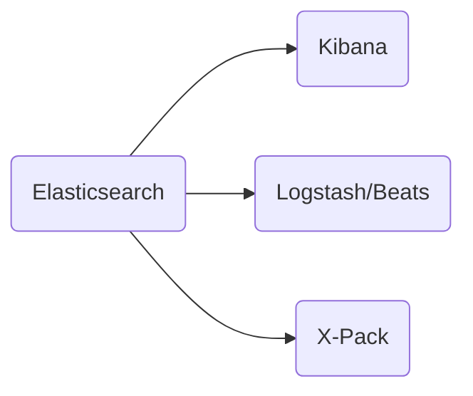

# Elasticsearch 8 and the Elastic Stack: In Depth and Hands On

### A Udemy Course

[Course](https://www.udemy.com/course/elasticsearch-7-and-elastic-stack/) |
[ElasticSearch Docs](https://www.elastic.co/webinars/getting-started-elasticsearch?rogue=webinar&baymax=&storm=hero&elektra=home)

## TOC

- [Introduction](#introduction)
- [Elasticsearch Overview](#elasticsearch-overview)
- [Intro to HTTP and RESTful APIs](#intro-to-http-and-restful-apis)

## Introduction

### Basic Commands
 - start elasticsearch on mac (installed with homebrew): `elasticsearch`
 - poll server: `curl -XGET 127.0.0.1:9200`

 ```json
 {
  "name" : "node-1",
  "cluster_name" : "elasticsearch",
  "cluster_uuid" : "7zDbLjTATs-KncZp6JLORg",
  "version" : {
    "number" : "7.17.4",
    "build_flavor" : "default",
    "build_type" : "tar",
    "build_hash" : "79878662c54c886ae89206c685d9f1051a9d6411",
    "build_date" : "2022-05-18T18:04:20.964345128Z",
    "build_snapshot" : false,
    "lucene_version" : "8.11.1",
    "minimum_wire_compatibility_version" : "6.8.0",
    "minimum_index_compatibility_version" : "6.0.0-beta1"
  },
  "tagline" : "You Know, for Search"
}
 ```
 
 - submit to elasticsearch (single document) to index: `curl -H "Content-Type: application/json" -XPUT 127.0.0.1:9200/shakespeare --data-binary @shakes-mapping.json`

 or
 
 - submit to elasticsearch (lots of documents) to index: `curl -H "Content-Type: application/json" -XPUT '127.0.0.1:9200/shakespeare/_bulk' --data-binary @shakespeare_8.0.json`
 - simple search for a phrase: `curl -H "Content-Type:application/json -XGET '127.0.0.1:9200/shakespeare/_search?pretty' -d`
 
 ```bash
 dquote> {
 dquote> "query" : {
 dquote> "match_phrase" : {
 dquote> "text-entry" : "to be or not to be"
 dquote> }
 dquote> }
 dquote> }'
 ```


[back](#toc)

## Elasticsearch Overview

### The Elastic Stack



1. Elasticsearch
    1. Started off as scalable Lucene
    2. Horizontally scalable search engine
    3. Each "shard" is an inverted index of documents
    4. But not just for full text search!
    5. Can handle structured data, and can aggregate data quickly
    6. Ofter a faster solution than Hadoop/Spark/Flink/etc.
    - basically a server than can handle JSON requests and send back information in JSON
2. Kibana
    1. Web UI for searching and visualization
    2. Complex aggregations, graphs and charts
    3. Often used for log analysis
    - sits on top of Elasticsearch
3. Logstash/Beats
    1. Ways to feed data into Elasticsearch
    2. FileBeat can monitor log files, parse them, and import into Elasticsearch in near-real-time
    3. Logstash also pushes data into Elasticsearch from many machines
    4. Not just log files
    - can collect data from numerous sources like S3, Kafka, etc.
4. X-Pack
    1. Security
    2. Alerting
    3. Monitoring
    4. Reporting
    5. Machine Learning
    6. Graph Exploration

[back](#toc)

## Intro to HTTP and RESTful APIs

### Rest: A Quick Intro

[back](#toc)